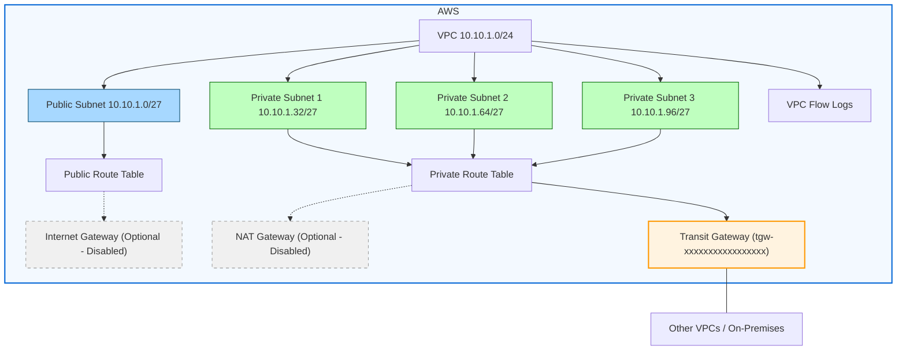

# VPC via AWS Transit Gateway (TGW) Deployment

## Overview

This Terraform solution provisions a **Virtual Private Cloud (VPC)** and connects it to an **AWS Transit Gateway (TGW)**.  
The TGW acts as a central hub for connecting multiple VPCs and on-premises networks, enabling secure and scalable network architectures.

---

## Why Use AWS Transit Gateway?

AWS Transit Gateway provides a **hub-and-spoke** model for network connectivity. Instead of creating complex peering relationships between VPCs, all VPCs connect to the TGW, which routes traffic between them.

### Benefits:
1. **Centralised Connectivity**  
   - Simplifies network topology by connecting all VPCs and on-premises networks to a single hub.
   
2. **Improved Security**  
   - Centralised routing allows for better control and monitoring of traffic.
   - Integration with AWS Network Firewall or third-party appliances for inspection.
   - Ability to enforce security policies at a single point.

3. **Scalability**  
   - Easily add or remove VPCs without reconfiguring multiple peering connections.

4. **Cost Efficiency**  
   - Reduces the number of VPC peering connections and associated management overhead.

---

## Security Advantages of TGW

- **Traffic Inspection**: All inter-VPC traffic can be routed through security appliances.
- **Segmentation**: Use route tables to isolate environments (e.g., Dev, Test, Prod).
- **Centralised Logging**: Monitor and log all network flows in one place.
- **Policy Enforcement**: Apply consistent security rules across all connected networks.

---

## Solution Architecture

1. **VPC Creation**  
   - Creates a VPC with public and private subnets.
   
2. **TGW Attachment**  
   - Attaches the VPC to an existing AWS Transit Gateway.
   
3. **Internet Gateway (Optional)**  
   - Provides internet access for public subnets.
   
4. **NAT Gateway (Optional)**  
   - Allows private subnets to access the internet securely.
   
5. **Routing**  
   - Configures route tables for public and private subnets.
   - Routes inter-VPC traffic via TGW.

6. **VPC Flow Logs**  
   - Enables logging for monitoring and security analysis.

---

## Deployment Steps

### 1. Prerequisites
- AWS account with appropriate permissions.
- Existing AWS Transit Gateway.
- Terraform installed locally.

### 2. Clone the Repository
```bash
git clone https://github.com/your-org/vpc-via-transit-gateway.git
cd vpc-via-transit-gateway
```

### 3. Configure Variables
Edit `terraform.tfvars` to set:
```hcl
AWS_Environment     = "dev"
AWS_Tags            = {
  Project = "MyProject"
  Owner   = "YourName"
}
VPC_CidrBlock       = "10.0.0.0/16"
Private_Subnet_Count = 2
Public_Subnet_Count  = 1
Transit_Gateway_ID   = "tgw-xxxxxxxx"
Igw                  = true
Nat                  = true
Flow_Log_Retention_Days = 30
```

### 4. Initialise Terraform
```bash
terraform init
```

### 5. Review the Plan
```bash
terraform plan
```

### 6. Apply the Configuration
```bash
terraform apply
```

### 7. Verify Deployment
- Check VPC, subnets, and TGW attachment in AWS Console.
- Verify route tables and flow logs.

---

## Clean Up
To remove all resources:
```bash
terraform destroy
```

---

## Secure Design of VPC

This design follows a common best practice for secure VPC architectures:

- **Private subnets** are intended for internal workloads (e.g., application servers, databases) that should not be directly accessible from the internet.  
  Connecting these to the **Transit Gateway** allows them to communicate with other VPCs or on-premises networks securely, without exposing them publicly.

- **Public subnets** are typically for internet-facing resources (e.g., load balancers, bastion hosts).  
  These usually do **not** need TGW connectivity because:
  - They already have internet access via an Internet Gateway (if enabled).
  - Routing public subnets through TGW could unintentionally expose internal networks to the internet-facing layer.

### Security Benefits of This Design:
- Limits TGW access to trusted, internal workloads.
- Reduces the attack surface by keeping TGW routes out of public subnets.
- Ensures that inter-VPC or hybrid connectivity is only available to private resources.

### When You Might Change This:
If you have a specific use case where public-facing resources need to communicate with other VPCs or on-premises networks via TGW (e.g., shared API gateways), you could add TGW routes to the public route table — but this should be carefully controlled with security groups and NACLs.

**In summary:** For most enterprise and secure cloud designs, **TGW connected only to private route tables is the recommended approach**.

## Notes
- Ensure TGW route tables are configured to allow traffic between connected VPCs.
- For enhanced security, integrate AWS Network Firewall or third-party appliances with TGW.


## Architecture Diagram


